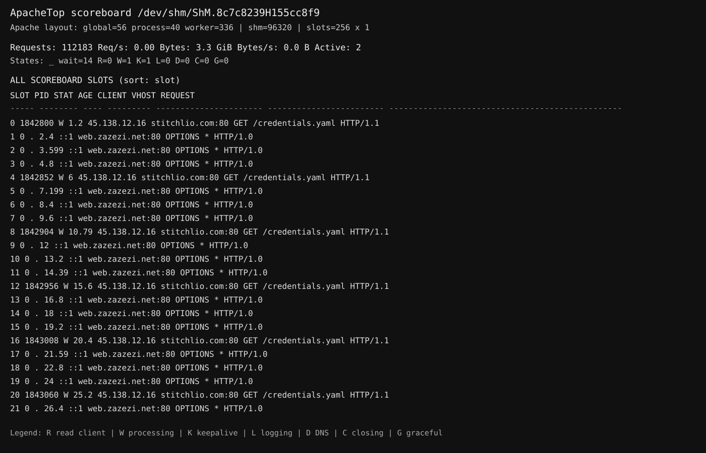

# apachetop-ng

A lightweight, read-only Apache HTTP Server scoreboard viewer inspired by `top`/`apachetop`.

`apachetop-ng` reads the Apache scoreboard directly from the APR shared-memory object in `/dev/shm/ShM.*`. It does not scrape `/server-status` over HTTP.



## Features

- Reads the Apache scoreboard directly from shared memory.
- Uses Apache's own `scoreboard.h` structures instead of duplicating the binary layout.
- Displays active, idle/ready, and optionally unused scoreboard slots.
- Shows client IP, vhost, request, worker state, PID, and age.
- Displays aggregate request/byte counters and rates.
- Sort by slot, age, client IP, or vhost.
- Automatically fits the number of displayed rows to the terminal height.
- Optional recent/last-request view.
- Configurable refresh interval.
- Can explicitly select a scoreboard file or auto-detect `/dev/shm/ShM.*`.

## Requirements

The Apache scoreboard must be available. This project is intended for Apache httpd installations with **`mod_status` loaded and `ExtendedStatus On`**.

On Debian/Ubuntu:

```bash
apt install apache2-dev libapr1-dev
```

Enable `mod_status` and extended status in Apache:

```apache
LoadModule status_module /usr/lib/apache2/modules/mod_status.so
ExtendedStatus On
```

The exact `LoadModule` path depends on the distribution/package layout.

## Build

```bash
gcc -O2 -Wall -Wextra -Wpedantic -std=c11 \
  -I/usr/include/apache2 \
  -I/usr/include/apr-1.0 \
  apachetop-ng.c \
  -o apachetop-ng
```

## Usage

```bash
./apachetop-ng
./apachetop-ng -a
./apachetop-ng -A
./apachetop-ng -i 2
./apachetop-ng -s age
./apachetop-ng -s client
./apachetop-ng -s vhost
./apachetop-ng -r
./apachetop-ng -f /dev/shm/ShM.8c7c8239H155cc8f9
./apachetop-ng -1
```

### Options

```text
-f PATH   explicit scoreboard file; default auto-detect /dev/shm/ShM.*
-i SEC    refresh interval (default 1.0s)
-t SEC    alias for -i
-n ROWS   maximum rows per section; default auto-fits terminal height
-s SORT   slot, age, client/ip, vhost/host
-a        show only active workers
-A        include all scoreboard slots, including unused/dead PID=0 slots
-1        display once and exit
-r        show recent/last-request section
-d        show calculated Apache/APR layout information
-h        show help
```

## Why a direct scoreboard reader?

The usual `mod_status` page is useful for humans, but it is awkward to consume from a terminal tool. `apachetop-ng` reads the same scoreboard data directly from shared memory, avoiding an HTTP request.

The program deliberately uses the Apache headers as the source of truth for `global_score`, `process_score`, and `worker_score`, and derives aligned sizes from the installed headers. This avoids hard-coding the current scoreboard structure into the application.

## Notes

The scoreboard contains worker/process state, counters, client/vhost/request information and timing fields. It is **not an access log**, so historical per-URL statistics are not available unless they can be derived from changes observed while the program is running.

`-A` is useful when diagnosing the scoreboard layout itself. In normal operation, unused `PID=0` / `SERVER_DEAD` slots are hidden so that reserved capacity does not dominate the display.

## License

License: TBD.
