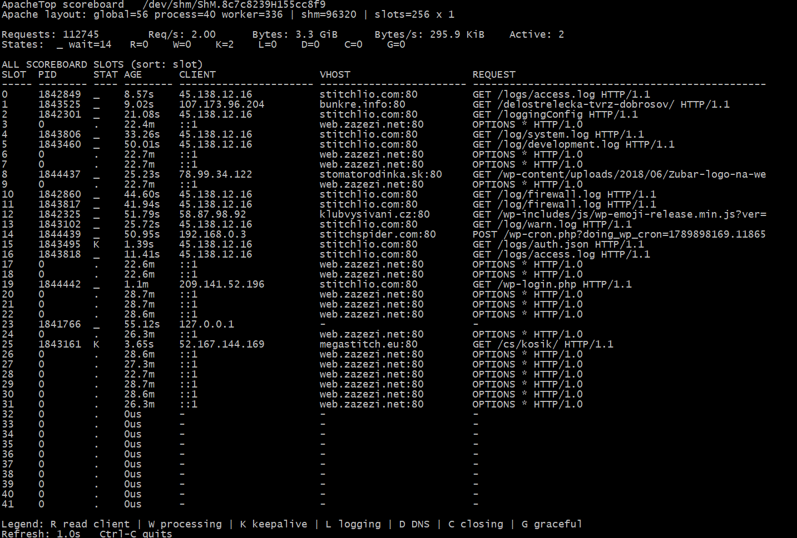

# apachetop

**Version: 0.1.0**

A lightweight, read-only Apache HTTP Server scoreboard viewer inspired by `top`/`apachetop`.

`apachetop` reads the Apache scoreboard directly from the APR shared-memory object in `/dev/shm/ShM.*`. It does not scrape `/server-status` over HTTP.



## Features

- Reads the Apache scoreboard directly from shared memory.
- Uses Apache's own `scoreboard.h` structures instead of duplicating the binary layout.
- Displays active, idle/ready, and optionally unused scoreboard slots.
- Shows client IP, vhost, request, worker state, PID, and age.
- Displays aggregate request/byte counters and rates.
- Sort by slot, age, client IP, or vhost.
- Automatically fits the number of displayed rows to the terminal height.
- Optional recent/last-request view.
- Configurable refresh interval.
- Can explicitly select a scoreboard file or auto-detect `/dev/shm/ShM.*`.

## Requirements

The Apache scoreboard must be available. This project is intended for Apache httpd installations with **`mod_status` loaded and `ExtendedStatus On`**. The Debian package depends on `apache2` (>= 2.4).

On Debian/Ubuntu:

```bash
apt install apache2-dev libapr1-dev
```

Enable `mod_status` and extended status in Apache:

```apache
LoadModule status_module /usr/lib/apache2/modules/mod_status.so
ExtendedStatus On
```

The exact `LoadModule` path depends on the distribution/package layout.

## Build

```bash
gcc -O2 -Wall -Wextra -Wpedantic -std=c11 \
  -I/usr/include/apache2 \
  -I/usr/include/apr-1.0 \
  apachetop.c \
  -o apachetop
```

## Debian packages

GitHub Actions builds and tests the Debian package on **Debian 12 (Bookworm)** and **Debian 13 (Trixie)**. The CI test runs Apache with the **prefork MPM**, loads **mod_status**, enables **ExtendedStatus On**, starts Apache, locates the real scoreboard under `/dev/shm/ShM.*`, and runs the packaged binary against it.

The Debian binary package is intentionally named **apachetop**, even though Debian already has a different package with that name. The Debian package version uses epoch `1:` so this build is not treated as a downgrade purely because it has the same package name. Release assets are named with their target suite, for example `apachetop_0.1.0-1_bookworm_amd64.deb` and `apachetop_0.1.0-1_trixie_amd64.deb`.

See the [Debian package workflow](../../actions/workflows/debian.yml) for builds. Published versions are available under [GitHub Releases](../../releases).

## Versioning

The application follows **Semantic Versioning**. The current release is **0.1.0** and the binary reports it with `-v` or `--version`:

```bash
./apachetop --version
```

The Debian package uses the normal Debian `upstream-version-debian-revision` scheme with epoch `1:` because the package name intentionally overlaps Debian's existing `apachetop` package. For example, application version `0.1.0` is packaged as `1:0.1.0-1`.

Use the upstream version for releases; increment the Debian revision for packaging-only changes.

## Usage

```bash
./apachetop
./apachetop -a
./apachetop -A
./apachetop -i 2
./apachetop -s age
./apachetop -s client
./apachetop -s vhost
./apachetop -r
./apachetop -f /dev/shm/ShM.8c7c8239H155cc8f9
./apachetop -1
```

### Options

```text
-f PATH   explicit scoreboard file; default auto-detect /dev/shm/ShM.*
-i SEC    refresh interval (default 1.0s)
-t SEC    alias for -i
-n ROWS   maximum rows per section; default auto-fits terminal height
-s SORT   slot, age, client/ip, vhost/host
-a        show only active workers
-A        include all scoreboard slots, including unused/dead PID=0 slots
-1        display once and exit
-r        show recent/last-request section
-d        show calculated Apache/APR layout information
-v        show version
--version show version
-h        show help
```

## Why a direct scoreboard reader?

The usual `mod_status` page is useful for humans, but it is awkward to consume from a terminal tool. `apachetop` reads the same scoreboard data directly from shared memory, avoiding an HTTP request. A key advantage is that it can keep working even when the server is overloaded: if Apache is full and the web-based `/server-status` endpoint is unavailable because there are no workers available to serve that request, `apachetop` can still inspect the scoreboard directly from shared memory.

The program deliberately uses the Apache headers as the source of truth for `global_score`, `process_score`, and `worker_score`, and derives aligned sizes from the installed headers. This avoids hard-coding the current scoreboard structure into the application.

## Notes

The scoreboard contains worker/process state, counters, client/vhost/request information and timing fields. It is **not an access log**, so historical per-URL statistics are not available unless they can be derived from changes observed while the program is running.

`-A` is useful when diagnosing the scoreboard layout itself. In normal operation, unused `PID=0` / `SERVER_DEAD` slots are hidden so that reserved capacity does not dominate the display.

## License

apachetop is licensed under the **GNU General Public License v3.0 only (GPL-3.0-only)**.

The Apache HTTP Server headers used at build time remain licensed by the Apache Software Foundation under their own license; they are an external build dependency and are not relicensed by apachetop.
